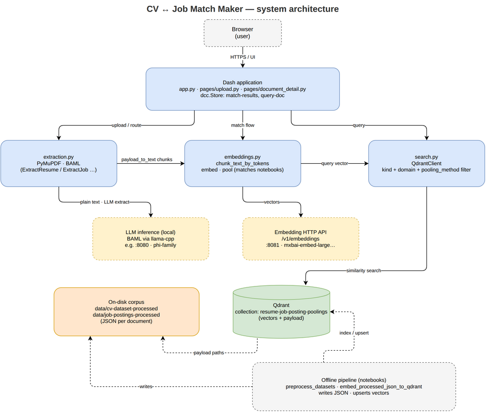
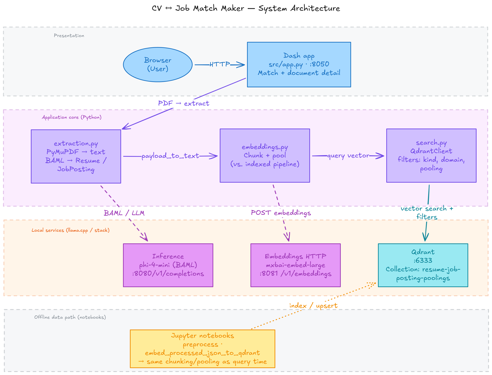

# CV-Job-Match

A sophisticated CV to job matching system that uses LLMs and vector databases to match resumes with job postings.

## Overview

This system extracts structured data from CVs/resumes and job postings using BAML and LLMs, stores them in a Qdrant vector database, and provides similarity matching to find the best job candidates for positions and vice versa.

## System architecture





Editable sources: `docs/cv-job-match-maker-architecture.drawio` and `docs/cv-job-match-maker-architecture.excalidraw`.

## Project Structure

```
cv-job-match/
├── baml_src/                 # BAML schema files and LLM prompts
│   ├── resume.baml           # Resume data model and extraction functions
│   ├── job_posting.baml      # Job posting data model and extraction functions
│   ├── clients.baml          # LLM client configurations
│   └── generators.baml       # Additional utility functions
├── baml_client/              # Generated Python client for BAML (auto-generated)
├── data/                     # Dataset files
│   ├── cv-dataset/                           # Original CV/resume documents (organized by domain)
│   ├── job-postings/                         # Original job postings CSV file
│   ├── cv-dataset-processed/                 # Processed CV/resume JSON files (organized by domain)
│   └── job-postings-processed/               # Processed job posting JSON files (organized by domain)
├── notebooks/                # Jupyter notebooks for data processing, testing, and exploration
│   ├── preprocess_datasets.ipynb             # Main notebook for preprocessing CV and job posting datasets
│   ├── baml_test_retrieval.ipynb             # Tests BAML extraction and retrieval functionality
│   ├── embed_processed_json_to_qdrant.ipynb  # Processes JSON data and stores embeddings in Qdrant
│   ├── ollama_connection.ipynb               # Tests connection to Ollama LLM servers
│   └── qdrant_quickstart.ipynb               # Quickstart guide for Qdrant vector operations
├── qdrant_storage/           # Local Qdrant vector database storage
├── src/                      # Source code for the application
│   ├── app.py                  # Entry point for the Dash application
│   ├── config.py               # Configuration settings
│   ├── embeddings.py           # Embedding generation utilities
│   ├── extraction.py           # Data extraction logic using BAML
│   └── pages/                  # Dash page components
│       ├── __init__.py
│       ├── upload.py
│       └── document_detail.py
├── pyproject.toml            # Project dependencies and configuration
├── uv.lock                   # Locked dependencies for reproducible installs
├── run-llama-servers.sh      # Script to start local LLM servers
├── docker-compose.yml        # Docker configuration (if applicable)
└── STRATEGY.md               # Document detailing scoring strategies
```

## Key Features

- **LLM-Powered Extraction**: Uses BAML to define structured data models and extract information from unstructured CV/job text using any LLM provider (Ollama, llama.cpp, external APIs, etc.)
- **Vector Storage**: Stores extracted features in Qdrant vector database for efficient similarity search
- **Multiple Scoring Strategies**: Implements various matching algorithms (top-k mean, weighted top-k mean, softmax pooling, hybrid score)
- **Modular Design**: Separates concerns with clear data models, extraction logic, and matching strategies
- **Extensible**: Easy to add new data fields, scoring strategies, or LLM providers via clients.baml

## Setup

### Prerequisites

- Python 3.12+
- UV package manager
- LLM provider running locally or accessible via API (Ollama, llama.cpp, external APIs, etc.)
- Docker (optional, for Qdrant)

### Installation

1. Clone the repository
2. Install dependencies using UV:
   ```bash
   uv sync
   ```

3. Start the local LLM servers:
   ```bash
   ./run-llama-servers.sh
   ```
   This starts:
   - Ollama LLM server on port 8080 (phi-4-mini for inference)
   - Ollama embeddings server on port 8081 (mxbai-embed-large for embeddings)

4. Ensure Qdrant is running (uses local storage at `./qdrant_storage`)

## Usage

### Data Processing

1. Process CV datasets:
    ```bash
    uv run jupyter notebook notebooks/preprocess_datasets.ipynb
    ```

2. Process job postings dataset similarly

### Testing Connections

- Test LLM connections: `notebooks/ollama_connection.ipynb` (can be adapted for other providers)
- Test Qdrant operations: `notebooks/qdrant_quickstart.ipynb`
- Test BAML extraction: `notebooks/baml_test_retrieval.ipynb`

### Running the Application

To start the Dash web application:

```bash
uv run python -m src.app
```

The application will be available at http://localhost:8050

The system can also be used programmatically through the BAML client or extended with additional processing scripts.

## Configuration

### BAML Clients

Defined in `baml_src/clients.baml`:
- `CustomOllama`: Uses OLLAMA_HOST environment variable
- `LlamaCpp`: For local LlamaCpp models
- `LlamaCppPCphi4Mini`: Specific Phi-4-mini configuration

### Environment Variables

- `OLLAMA_HOST`: Host for Ollama API (default: localhost:11434)
- Other LLM-specific variables as needed

## Scoring Strategies

See `STRATEGY.md` for detailed explanation of matching algorithms:
1. Top-k Mean (Best Practical Default)
2. Weighted Top-k Mean
3. Softmax Pooling (Smooth Max)
4. Hybrid Score (Very Robust)

## Development

### Modifying BAML Schemas

1. Edit `.baml` files in `baml_src/`
2. Regenerate client: `uv run baml-cli generate` (run from baml_src/ directory)
3. Import generated client from `baml_client` in Python code

### Adding New Features

1. Extend data models in `.baml` files
2. Add extraction functions with appropriate prompts
3. Update processing notebooks to handle new fields
4. Consider impact on matching/scoring strategies

## Dependencies

Core dependencies specified in `pyproject.toml`:
- BAML-py: For LLM-powered data extraction
- Qdrant-client: Vector storage and similarity search
- Pandas: Data manipulation
- Scikit-learn: Additional ML utilities
- Pymupdf/Pdfplumber: PDF processing
- Python-docx: Word document processing
- Streamlit: Potential web interface
- Jupyter: Notebooks for experimentation
- Ollama: Local LLM API client

## Acknowledgments

- **[drawio-skill](https://github.com/Agents365-ai/drawio-skill)** (MIT): Agent skill used for Draw.io diagrams. Files are vendored under `.agents/skills/drawio-skill/`; see [.agents/skills/drawio-skill/VENDOR_NOTICE.md](.agents/skills/drawio-skill/VENDOR_NOTICE.md) for upstream link, pinned commit, and license text.